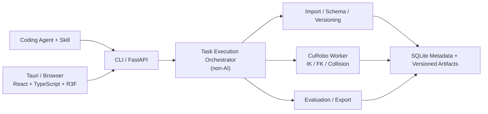

# EEF 轨迹本体化工具：前产品规划（已归档）

> **⚠️ 历史归档，2026-08-27 卸任。本文已不是现行基线，不得作为实现依据。**
>
> 现行基线为 [`product-plan-v2.md`](./product-plan-v2.md)，施工按 [`build-checklist.md`](./build-checklist.md)。
>
> **保留价值是追溯：** 本文记录 2026-08-14 时点的范围认定。其中五机器人正式支持、九工作区完整前端、Tauri 桌面壳、认证等级与审批门禁、Agent 自动修复等，**已在 v2 中移出首版**，理由见 v2 §13。与 v2 冲突处一律以 v2 为准。
>
> 以下为归档原文，未作修改。

---

> **文档状态：现行规划基线。** 本文重新定义 `v1.0` 与后续发展范围。此前讨论归档保留决策过程；与本文冲突时，以本文为准。
>
> **当前产品方向：** 首个正式版本是一套完整的 **Agent-first 运动学数据处理产品**，而不是同时建设运动学工具和物理仿真平台。

## 1. 产品定义

产品只接收外部已经准备好的 EEF 位置、位姿和事件轨迹，将其转换为指定机器人的连续关节轨迹，并在同一工作流中完成。若参考数据原本是源机器人关节轨迹，源机器人 FK 转成 EEF 属于导入本工具之前的预处理，不属于本产品：

1. 输入解析与语义确认；
2. 机器人本体映射；
3. IK/FK 求解与运动学约束检查；
4. 轨迹诊断、自动修复和候选比较；
5. 机器人模型上的三维回放；
6. 人工审核、个性化微调和局部重绘；
7. 可追溯评估、审批与标准化导出。

产品不是新的 IK 算法库。其价值是把数据语义、本体配置、连续求解、诊断、Agent 自动处理、人工接管、版本谱系和导出组合成可靠的完整闭环。

## 2. 版本边界总览

| 范围 | `v1.0` | 后续版本 |
|---|---|---|
| 核心目标 | 完整运动学数据处理与本体化 | 在稳定运动学产物之上增加生态与仿真能力 |
| 求解 | CuRobo IK/FK、连续轨迹、几何碰撞 | 可选 CPU 后端和更多求解策略 |
| 验证 | 运动学、约束、静态几何碰撞、FK 回放 | 物理控制、接触、任务成功和鲁棒性仿真 |
| 交互 | 完整独立前端、Agent Skill、人工微调 | 仿真场景编辑、相机与任务验证界面 |
| 机器人 | 四种代表性形态、五个正式适配目标的明确运动学范围 | 更多机器人、移动与全身能力扩展 |
| 安装 | `core + curobo` 原生模块化安装 | 可选 `simulation`、生态适配和冻结容器 |
| RoboTwin | 不作为运行依赖；只预留适配边界 | 数据/任务适配及正式仿真验证 |

`v1.0` 的“完整”指产品闭环、可安装性、可恢复性、可审核性和正式发布质量完整，不表示首版囊括物理仿真、训练平台或真机控制。

## 3. v1.0 核心工作流

```text
导入源数据
→ Agent/适配器识别字段与语义
→ 必要语义由用户确认
→ 生成规范 EEF 轨迹版本
→ 选择 Robot Profile、运动组与 TCP
→ 坐标对齐、姿态策略和初始状态配置
→ CuRobo IK/FK 与连续轨迹求解
→ 平滑、重采样和重新定时
→ 误差、限位、奇异、跳变和几何碰撞诊断
→ Agent 有界修复并比较候选
→ 三维运动学回放与人工接管
→ 重新求解、评估和审批
→ 生成可追溯导出包
```

### 3.1 Agent-first 主流程

1. 用户自己的 Coding Agent 通过项目 Skill 调用稳定的 CLI 或本地 API。
2. Agent 负责理解任务、制定计划、调用工具、读取诊断、提出修复、组织受限实验和整理结果。
3. CuRobo及确定性程序负责生成关节轨迹、FK结果、碰撞结果和质量指标；Agent不能伪造数值结论。
4. 四档自治策略继续保留，从多次人工确认到达标后自动修复、复验和导出。
5. 无论自治挡位如何，数据语义红线、硬约束和最低质量门槛不降低。

### 3.2 人工工作流

独立前端不是只读监控页，而是完整的接管与微调工具，首版包括：

- 输入字段、单位、坐标系、TCP、运动组和姿态语义确认；
- 源 EEF、目标 EEF、实际 FK、关节状态和诊断结果同步查看；
- EEF 关键帧、位置、姿态、事件、容差和时间参数编辑；
- 平滑、插值、重采样、重新定时及局部重算；
- 关节曲线查看、异常定位、局部关节约束和关键点修正；
- 候选同步回放、指标比较、审批、驳回和回退。

首版不建设 Blender 式完整关节动画曲线编辑器。人工编辑重点是 EEF 目标和运动学约束，关节空间提供诊断与有限专家修正。

产品入口以Tauri桌面端为默认专业入口；同一套React/TypeScript/R3F前端同时提供同版本浏览器入口，用于连接远程Linux/GPU服务器。浏览器入口不是功能降级版，两种入口共用任务、版本、审批和导出逻辑。

### 3.3 鼠标绘制与局部重绘

鼠标轨迹功能纳入 `v1.0`，但定位为运动学 Playground 和人工修复工具，而不是数据处理主线：

```text
平面或表面绘制 EEF 路径
→ 调整深度、关键点和姿态策略
→ 平滑、采样和时间化
→ CuRobo 求解
→ 自动诊断
→ 机器人模型立即回放
```

支持整条草图创建，也支持圈选原轨迹区间后局部重绘。首版不承诺边画边实时控制仿真或真实机器人。

## 4. v1.0 功能范围

### 4.1 输入与语义契约

- 原生 `CanonicalTrajectory` Schema；
- CSV、JSON、HDF5、Zarr 等容器的可配置字段映射；
- 位置或位姿轨迹、时间、夹爪/离散事件及可选同步通道；
- 单位、参考坐标系、绝对/相对语义、旋转表示、TCP和时间语义显式记录；
- 缺少姿态时进入位置约束模式，缺少时间时作为几何路径重新定时；
- 无可靠证据的关键语义不得被 Agent 静默采用。

特定数据集适配器按经过测试的版本声明兼容，不因文件容器相同而宣称 Schema 兼容。

`CanonicalTrajectory v1` 是首版唯一规范内部契约，至少包含：

- `schema`：名称与版本；
- `source`：数据集/episode标识、原文件及SHA-256；
- `coordinate`：源坐标系、目标机器人base、左右手系、单位和可追溯变换链；
- `motion_groups`：单臂、双臂或上半身运动组，以及各自TCP、轨迹模式和有序位置/位姿样本；
- `channels`：时间、夹爪及其他与运动组绑定的数值通道；
- `events`：抓取、释放、停留和同步事件；
- `task_constraints`：姿态模式、关键帧、容差、同步和相对约束；
- `provenance`：语义证据、父版本、Agent/人工确认和转换记录。

首批正式输入支持限定为：原生 `CanonicalTrajectory v1` JSON、具有显式 `MappingSpec` 的CSV，以及针对明确版本通过测试的HDF5/Zarr适配器。文件后缀相同不等于Schema兼容。

### 4.2 Robot Profile 与多运动组

每个机器人适配包至少包含：

- `RobotAssetAdapter` 与 `RobotProfile` 抽象；v1.0 首先适配 URDF/Xacro，未来可接入 MJCF、USD 等格式；
- URDF/Xacro与资源校验；
- base、joint、link、运动组、EEF和TCP定义；
- 关节限制、默认姿态、种子策略与允许锁定的自由度；
- CuRobo运动学和碰撞配置；
- 单臂、双臂或上半身的能力清单；
- FK、IK、映射、边界、负向案例和回归测试资产。

所有映射按名称与显式坐标语义完成，不能依赖数组顺序或隐式约定。

### 4.3 IK/FK 与轨迹处理

- GPU批量 IK、逐帧 warm-start 和连续性优化；
- FK复算及目标 EEF 与实际 EEF 误差；
- 多解分支选择、初始姿态与冗余自由度约束；
- 单EEF、多EEF和多运动组同步求解；
- 位置约束、位姿约束及分段姿态策略；
- 关节位置、速度、加速度和可配置 jerk 约束；
- 平滑、缺失段候选修复、重采样和时间参数化；
- 自碰撞以及针对静态环境几何的碰撞检查。

静态环境几何只用于 CuRobo 的几何可行性检查，不包含重力、摩擦、接触力、物体动力学或控制器跟踪。

### 4.4 诊断与 Agent 修复

诊断至少覆盖：

- 不可达与局部不可解；
- EEF误差超限；
- 关节越界和约束裕量不足；
- 奇异或病态区域；
- 关节分支跳变和轨迹不连续；
- 自碰撞与静态环境碰撞；
- 速度、加速度、时间戳或事件不合法；
- 输入语义不足或配置不一致。

Agent修复必须通过版本化 `ChangeProposal` 和有预算的 `ExperimentBatch` 执行，可尝试坐标微调、姿态放宽、初始状态、求解参数、局部平滑、重采样、时间化和授权范围内的路径修正。触及语义红线、硬约束或预算上限时转人工。

### 4.5 回放、版本与评估

- 三维机器人、EEF坐标系、路径、碰撞点和诊断区间可视化；
- 时间轴、关节/EEF曲线、事件和多候选使用统一播放时钟；
- 原始数据不可覆盖，配置修改产生新版本，执行产生不可变 Run；
- Run、评估、人工/自动决策和导出相互分离；
- 依赖变化触发重新计算、重新评估或重新审批，而不是删除历史结论；
- 所有正式结果记录输入、配置、软件环境、运行指纹和变更谱系。

`v1.0` 的结果保证只覆盖 `A1 Kinematics Assurance`：运动学、轨迹约束和已提供静态几何上的检查。报告必须明确写出物理执行、接触和任务成功均未验证。

### 4.6 导出

标准导出包至少包含：

- 规范 EEF 轨迹与目标机器人关节轨迹；
- joint names、时间戳、`q`、可选 `qd/qdd`、夹爪和事件通道；
- Robot Profile、映射、坐标、TCP和求解配置快照；
- FK误差、约束、碰撞、诊断和评估报告；
- Agent修改、候选比较、审批记录和完整清单；
- 软件环境、哈希、版本谱系及未执行检查声明。

标准制品结构为 `CanonicalExportBundle`：`manifest.json`、规范/关节轨迹、Robot Profile与资产清单、FK/碰撞/质量报告、Run与修改/审批谱系，以及可选媒体目录。

默认采用 `FULL_BUNDLE`：关键轨迹、配置、评估、决策、证据及引用到的原始媒体完整打包；每个文件同时保留相对路径、大小、MIME类型、来源和SHA-256。另提供显式选择的 `REFERENCE_BUNDLE`，只保留大型媒体的内容哈希与外部引用。任何缺失引用都必须使制品标记为不完整，历史导出不可被覆盖。

## 5. v1.0 产品与系统架构



### 5.1 进程边界

- React、TypeScript和R3F前端同时用于Tauri桌面壳与浏览器远程入口；
- FastAPI是Coding Agent、桌面端和浏览器共用的薄API与任务边界；
- API、Task Execution Orchestrator、索引和权限首版采用模块化单体，不拆成HTTP微服务群；该 Orchestrator 只负责计划校验、检查点、重试、恢复、权限和导出门禁，不是内置 Agent Runtime；
- CuRobo使用独立长生命周期GPU worker，避免重复加载CUDA和机器人模型；
- SQLite保存任务、版本、状态、审批和索引，大数组与运行产物使用版本化文件制品；
- REST用于命令和对象管理，WebSocket用于进度、事件、日志和交互回放状态。

首批稳定CLI/API能力统一为：`doctor`、`inspect`、`validate-input`、`normalize`、`solve`、`evaluate`、`diagnose`、`propose-fix`、`apply-fix`、`replay`、`export`、`status`、`resume`、`cancel` 和 `diff`。Skill只调用这些公开的结构化契约，不依赖内部Python模块路径，也不实现IK或直接生成关节数值。

`CanonicalTrajectory`、`RobotProfile`、`Run` 和 `CanonicalExportBundle` 分别版本化；Skill启动时执行API版本和能力握手。不兼容版本明确拒绝，不能静默降级；旧Run和导出包必须保持可读、可检查和可重新评估。

### 5.2 安装与运行

`v1.0` 默认采用原生模块化安装：

```text
core     Python服务、CLI、前端和基础数据能力
curobo   NVIDIA/CUDA/PyTorch/CuRobo求解环境
```

- 官方目标环境为 Ubuntu/Linux + NVIDIA，以及 Windows 11 + WSL2 + NVIDIA；
- Tauri负责环境检查、启动/连接后端、健康检查和Windows/WSL路径映射；
- 统一安装器和 `doctor` 检查驱动、CUDA、WSL、依赖、资产、端口与写入权限；
- 本地与单台远程Linux服务器均走相同的原生安装路径；
- Compose不是必需安装方式，只作为CI、认证复现或用户主动选择的隔离部署工具；
- `v1.0` 不安装SAPIEN、ManiSkill或RoboTwin，因此其WSL渲染限制不构成首发阻塞项。

实验室双RTX 4090服务器作为首发冻结认证环境：用于GPU回归、压力测试和发布证据，不构成用户运行要求。默认按任务分配GPU，不建设跨机器分布式调度；正式冻结前现场记录并锁定Linux、驱动、CUDA、PyTorch、CuRobo及测试资产版本。

## 6. v1.0 机器人范围

首版按运动学形态覆盖四种形态，同时正式适配五个目标，不按品牌数量堆叠：

| 机器人 | 代表能力 | `v1.0` 边界 |
|---|---|---|
| Franka Panda | 7-DOF冗余单臂 | 单EEF、冗余解、静态碰撞和完整运动学闭环 |
| OpenArm | 与 Panda 同位的 7-DOF 冗余单臂 | 与 Panda 共享同类运动学验证范围，但使用独立 Robot Profile 和适配测试 |
| UR5e | 6-DOF工业单臂 | 非冗余单臂、不同关节拓扑和工业臂约束 |
| ALOHA | 固定基双臂 | 双EEF、多运动组、同步与臂间碰撞 |
| Unitree G1 | 高自由度人形上半身 | 暂定 29 自由度模型；v1.0 固定 root 和双腿，承诺腰部、双臂及明确支持的手部/TCP 通道 |

G1 的 v1.0 上半身控制范围暂按 17 个上半身自由度（腰部 3 + 双臂 7+7）规划，手部通道另行声明；不承诺步态、平衡、移动、全身动力学控制或完整灵巧手重定向。

### 6.1 支持与认证等级

- `T0`：未通过正式适配测试；
- `T1`：运动学回放、诊断和负向案例验证；
- `T2`：在认证输入、配置和规则范围内允许达标自动导出；
- `T3`：在认证参数空间与预算内允许自动修复、复验和导出。

四种形态、五个目标的最终T1/T2/T3承诺不预先写死，依据实现后的冻结测试结果分级发布；不能用未测试能力填满等级。

## 7. v1.0 发布门槛

`v1.0` 不是功能演示。正式发布至少满足：

1. Coding Agent Skill、CLI/API和独立前端均可完成同一核心闭环；
2. 四档自治、人工接管、取消、重试、恢复、候选比较和原子导出可用；
3. 四种形态、五个正式目标达到各自最终承诺的认证等级，未支持能力在UI和清单中显式降级；
4. 官方负向测试集中的硬失败错误放行数为零；
5. 输入语义、版本、Run、评估、审批和导出全程可追溯；
6. 历史产物不可被静默覆盖，升级后仍可读取和验证；
7. Linux和WSL目标环境完成安装、升级、故障诊断和端到端测试；
8. 发布包含冻结版本、迁移说明、能力清单、已知限制和 `ReleaseEvidenceManifest`。

内部仍可按Panda单臂、UR5e、ALOHA、第四形态、批量与发布加固的纵向里程碑开发，但这些是开发检查点，不是四个残缺产品。最终统一发布完整 `v1.0`。

## 8. v1.x：运动学生态增强

`v1.x` 在不改变产品核心保证的前提下扩展：

- 更多经过测试的数据适配器和导出器；
- 更多机器人Robot Profile和社区适配包；
- CPU后端候选，如 `Pink + Pinocchio` 或 `Mink + MuJoCo` 的运动学模式；
- 更大规模批处理、缓存、性能和远程单机使用体验；
- 更丰富的轨迹草图、约束模板和专家编辑能力；
- 更多Coding Agent Skill或通用Agent工具协议适配。

RoboTwin或LeRobot的纯数据Schema适配可以在 `v1.x` 提供，但必须与“已在其仿真任务中验证”分开声明。

## 9. v2.0：可选仿真验证扩展

仿真以可选扩展包加入，不改变 `v1.0` 运动学闭环独立可用的原则：

```text
v1 ReplayArtifact
→ SAPIEN 控制器跟踪与场景物理回放
→ 可选 ManiSkill / RoboTwin 场景任务适配
→ 接触、物体状态、任务结果与鲁棒性证据
```

计划范围包括：

- SAPIEN物理验证worker；
- 位置/PD等认证控制器跟踪；
- 动态碰撞、接触、摩擦、抓取与释放；
- 场景、初始状态、物理参数、种子和成功条件版本化；
- 可选ManiSkill任务抽象与RoboTwin版本化适配；
- RGB、深度、分割等仿真相机；
- `A2 Physics Assurance` 与 `A3 Task Assurance`；
- 多种子扰动和鲁棒性评估。

届时再解决SAPIEN/Vulkan、RoboTwin在WSL上的GPU渲染边界；完整仿真可以要求原生或远程Linux，不反向限制 `v1.0` 的Windows/WSL支持。

## 10. 更长期预留但未承诺

以下方向只保留数据模型和适配边界，不进入当前确定版本：

- 完整多模态训练episode生成；
- 视觉或视频到EEF轨迹提取；
- VLA训练、策略服务和benchmark平台；
- 大规模多机分布式调度；
- 自动向真实机器人下发轨迹；
- 步态、平衡、移动和完整人形全身控制。

真实机器人执行即使未来建设，也必须是单独的安全边界，不能由A1/A2/A3结果自动推导为真机安全。

## 11. 规划闭合状态与实施期决定

截至2026-08-14，v1.0的产品范围、输入边界、机器人形态、Agent入口、运动学工作流、人工前端、安装方式、制品策略和仿真边界已经闭合，不再保留阻塞开发的架构待确认项。

以下内容明确留到实施和测试阶段按证据决定，不视为规划缺口：

1. 五个正式目标各自最终达到T1、T2还是T3；
2. 实验室双RTX 4090服务器现场核验后冻结的驱动、CUDA、PyTorch和CuRobo精确版本；
3. 首批真实数据集、冻结测试样例及其分布；
4. 前端具体页面布局、控件细节和视觉设计；
5. 项目正式名称、开源许可证、README和首次发布运营细节。

关于仿真器、控制器、RoboTwin任务、相机和A2/A3的选择全部属于 `v2.0`，不再阻塞 `v1.0`。
