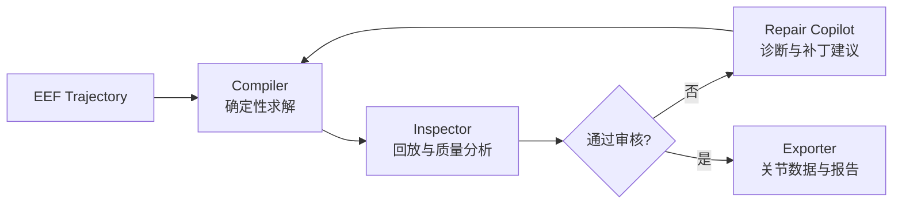
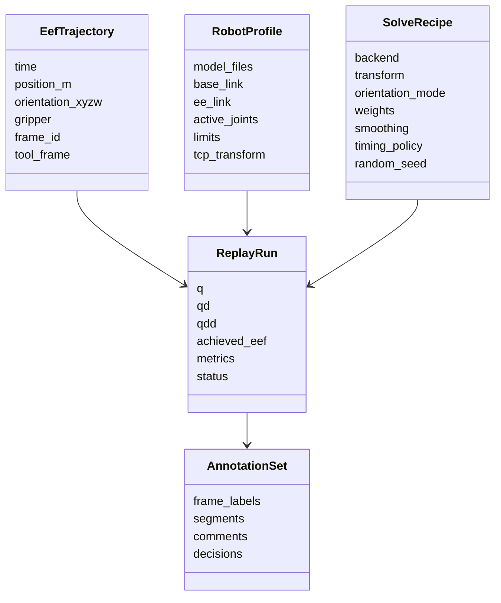
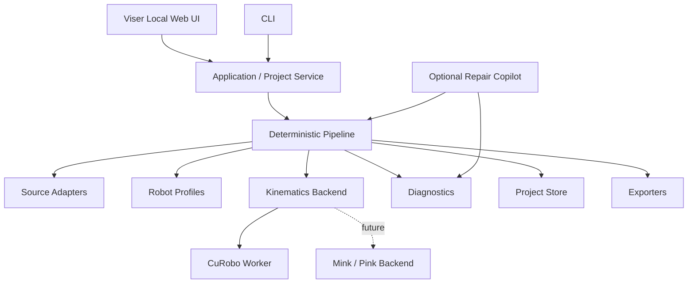

# EEF 末端轨迹本体化工具：全工作流、架构与技术选型评审

> **文档状态：历史架构评审（早期基线）。** 本文保留早期调研、技术比较与设计依据，其中版本、Agent、前端和仿真范围已不再代表当前规划。现行 `v1.0` 与后续路线以 [`current-product-plan.md`](./current-product-plan.md) 为准；阶段性讨论过程见 [`planning-discussion-archive.md`](./planning-discussion-archive.md)。
>
> **使用限制：** 本文不能作为实现需求清单。特别是“v0.1单机器人”“Viser主界面”“内置Agent/Copilot”以及首版物理仿真等早期建议均已被后续决策覆盖；保留相关段落仅用于追溯技术选择。

> 评审日期：2026-08-09  
> 当前阶段：需求收敛与技术路线选择  
> 核心输入：带时间信息的 EEF（End-Effector）末端位置或位姿轨迹  
> 核心输出：目标机器人的关节轨迹、运动学回放结果、质量标注和可复现配置

## 1. 执行摘要

### 1.1 推荐定位

项目不应定位成新的通用机器人框架，也不应定位成普通数据集播放器。更准确的定位是：

> **一个离线优先的 EEF 轨迹本体化编译、回放审核与修正工具。**

可以把产品理解为三部分：

1. **Trajectory Compiler**：把统一表示的 EEF 轨迹和目标机器人配置，确定性地转换为关节轨迹。
2. **Replay Inspector**：在机器人模型上回放求解结果，显示误差、不可达、碰撞、奇异、限位和不连续片段。
3. **Repair Copilot**：使用规则、搜索和可选 Agent 分析失败原因，提出结构化修正方案，由用户确认后重算。

核心闭环是：

```text
导入 EEF 轨迹
→ 显式确认单位、坐标系、姿态约定和时间语义
→ 选择目标机器人及末端执行器
→ 配置源坐标系到机器人基座的变换
→ 求解连续关节轨迹
→ FK 回放并生成逐帧质量指标
→ 定位失败片段并修正
→ 用户审核
→ 导出关节数据、质量标注和完整求解配方
```

### 1.2 最重要的架构结论

- **CuRobo V2 是当前最强的 GPU 主后端候选**，但项目不能只是 CuRobo 的网页包装。
- **Pinocchio 和 MuJoCo 本身都不是完整的轨迹 IK 产品**；CPU 路线应该比较 `Pink + Pinocchio` 和 `Mink + MuJoCo`。
- **v0.1 可以先采用 Python + Viser**，不用立即承担 React、Three.js 和独立 API 服务的开发成本。
- **TOPPRA 更适合离线整段路径时间参数化**；Ruckig 社区版的多路点功能会使用云端 API，不适合作为离线主路径。
- **Agent 不负责直接生成关节角**，而是读取确定性诊断结果、运行受限参数实验并提交配置补丁建议。
- **运动学回放和本体标注不能拆成两个孤立系统**：每次求解产生的 `q(t)`、误差、状态和人工修正共同构成一次本体化标注结果。
- **第一阶段应面向 Ubuntu + NVIDIA GPU 的实验室工作站或私有服务器**；不承诺普通 Windows CPU 设备即装即用。

### 1.3 推荐技术路线

| 层级 | v0.1 推荐 | 备选或后续 |
|---|---|---|
| 主求解后端 | CuRobo V2 | Mink + MuJoCo；Pink + Pinocchio |
| 时间参数化 | 保留原时间戳并验证；需要重定时则 TOPPRA | Ruckig 用于点到点或交互演示 |
| 本地网页 | Viser + Plotly/uPlot | React + Three.js/R3F + FastAPI |
| Python 工程 | Python 3.11、Pydantic、NumPy、SciPy | Polars、PyArrow、Zarr |
| 内部持久化 | YAML/JSON 配置 + NPZ 数组 + JSONL 标注 | Parquet/Zarr 项目存储 |
| 生态导出 | CSV/JSON、HDF5 | LeRobotDataset v3、RoboTwin、MCAP |
| Agent | 可关闭；OpenAI-compatible/Ollama 适配 | 本地规则学习、批量参数搜索 |
| 部署 | `uv` 原生环境；NVIDIA Docker 镜像 | 实验室 LAN 私有部署 |

## 2. 问题定义与边界

### 2.1 “无本体数据”的当前含义

本项目中的“无本体数据”主要指：数据描述了任务空间中的末端轨迹，但尚未绑定到某一具体机器人的关节结构。

最典型输入为：

```text
timestamp, x, y, z, qx, qy, qz, qw, gripper, confidence
```

其中：

- 位置是必选或主要信号。
- 姿态可能完整、部分可信或完全缺失。
- 时间戳可能代表真实演示速度，也可能只是采样顺序。
- 轨迹可能位于相机坐标系、世界坐标系、源机器人基座坐标系或未知局部坐标系。
- 数据尚不包含目标机器人可直接执行的关节位置 `q(t)`。

因此核心问题不是普通 IK，而是：

> **在保持 EEF 轨迹语义的前提下，为给定机器人寻找连续、约束可行、可诊断且可审核的关节轨迹。**

### 2.2 不同输入应走不同分支

| 输入类型 | 应走的流程 | 是否属于主线 |
|---|---|---|
| EEF 位置轨迹 | 位置约束 IK、冗余解析、连续性优化 | 主线 |
| EEF 6D 位姿轨迹 | 位姿约束 IK、姿态权重与放松 | 主线 |
| EEF + 夹爪轨迹 | 机械臂 IK + 夹爪通道映射 | 主线 |
| 已有目标机器人关节轨迹 | 跳过 IK，直接 FK 回放和质量检查 | 辅助分支 |
| 其他机器人关节轨迹 | 先恢复源 EEF，再进行目标机器人本体化 | 后续分支 |
| 人体骨架、BVH、SMPL | 多连杆 retargeting | 非当前主线 |
| 原始视频 | 先由外部方法估计 EEF，再进入本工具 | 上游生态，不纳入核心 |

### 2.3 明确非目标

第一阶段不应承担：

- 从原始视频估计手部或 EEF 轨迹。
- 重新实现一套通用 IK、碰撞检测或轨迹优化算法库。
- 训练 VLA、模仿学习策略或负责策略评测。
- 构建 RoboTwin、Isaac Sim 一类完整任务仿真平台。
- 直接下发真机并宣称运动学回放等价于真机安全验证。
- 同时支持所有机械臂、双臂、人形、移动底盘和灵巧手。
- 第一版就支持 Windows、macOS、Linux、CPU、CUDA 的全组合。

## 3. 产品方案空间评审

### 3.1 可选产品形态

| 产品形态 | 价值 | 主要问题 | 建议 |
|---|---|---|---|
| 纯 IK SDK/CLI | 工程复用简单、易测试 | 与 CuRobo、Mink、Pink 重叠，用户体验弱 | 作为底层能力，不作为完整产品定位 |
| EEF 轨迹编译器 | 输入输出清晰、适合批处理 | 如果没有诊断和审核，容易沦为脚本 | 必须做 |
| 交互式回放审核工作台 | 直接解决数据人员痛点，容易展示 | 前端工作量较大 | 推荐作为主产品形态 |
| 数据标注平台 | 能积累人工审核结果 | 单纯人工打标签差异化不足 | 与回放求解整合，不单独建设 |
| Agent-first 工具 | 演示效果强 | 容易让 LLM 代替数值算法，可靠性差 | 作为 Copilot，不作为核心 |
| 批量数据生产流水线 | 对实验室大规模转换有价值 | 需要任务恢复、资源调度和统计 | v0.2 以后扩展 |
| 完整物理仿真平台 | 能验证接触和动力学 | 工作量和竞争范围过大 | 不做；只提供可选仿真验证适配器 |
| 云端 SaaS | 易访问、可协作 | GPU 和存储成本、数据隐私、运维 | 当前排除 |
| 本地 Web / 私有部署 | 网页体验、数据不出本地、资源由用户提供 | 环境安装仍需解决 | 推荐 |

### 3.2 最推荐的产品组合



这套组合与现有工具的关系是：

- CuRobo、Mink、Pink、Drake 提供数值求解能力。
- Viser、Rerun 提供可视化和时间数据基础能力。
- RoboTwin、LeRobot 提供下游数据和训练生态。
- 本项目填补的是这些能力之间的**统一工作流、质量闭环、人工审核和可复现导出**。

因此，项目的差异化不应表述为“没有开源 IK/回放工具”，而应表述为：

> 现有开源库分别解决 IK、规划、仿真、可视化或数据格式问题，但面向 EEF 轨迹本体化的数据导入、配置、连续求解、逐帧诊断、交互修正和可追溯导出仍然高度碎片化。

## 4. 完整工作流 Review

### 4.1 阶段 0：项目与运行环境预检

目标：在真正求解前发现环境和模型问题。

检查项：

- CUDA、驱动、PyTorch、CuRobo 版本。
- GPU 型号、显存和可用状态。
- 机器人模型、网格和碰撞几何能否加载。
- EEF link、基座 link、活动关节顺序和关节限位。
- 单位、右手系、四元数顺序和变换命名规则。

输出：`EnvironmentReport` 和 `RobotModelReport`。

痛点：大量“求解失败”实际上是模型路径、关节名称、单位或坐标约定错误。

解决：必须把预检变成正式步骤，不要等 IK 报错后再猜。

### 4.2 阶段 1：导入与字段映射

输入适配器负责读取 CSV、JSON 或已有数据集中的 EEF 通道。

用户需要确认：

- 时间列。
- `x/y/z` 列及单位。
- 姿态表示：四元数、旋转矩阵、欧拉角或无姿态。
- 四元数顺序：`xyzw` 或 `wxyz`。
- 欧拉角顺序和内旋/外旋。
- 轨迹所在参考坐标系。
- 实际工具中心点对应的机器人 link 或 TCP 偏移。
- 夹爪列的语义、范围和正负方向。

系统应同时保存：

- 原始文件，不覆盖。
- 用户确认后的字段映射。
- 解析警告和无法解析的行。
- 原始数据哈希。

### 4.3 阶段 2：规范化为内部轨迹表示

推荐内部约定：

- 长度单位：米。
- 角度单位：弧度。
- 坐标系：右手系。
- 四元数内部顺序：`xyzw`，由后端适配器转换为 CuRobo 的 `wxyz`。
- 变换命名：明确使用 `T_target_from_source`，避免 `T_ab` 歧义。
- 时间：从 0 开始的单调 `float64` 秒。
- 缺失姿态：保留为 `None` 或 mask，不能擅自填单位四元数。

推荐核心对象：

```python
class EefTrajectory:
    time: FloatArray               # [T]
    position_m: FloatArray         # [T, 3]
    orientation_xyzw: FloatArray | None  # [T, 4]
    orientation_mask: BoolArray | None
    gripper: FloatArray | None     # [T, G]
    confidence: FloatArray | None  # [T]
    frame_id: str
    tool_frame: str
    metadata: dict
```

规范化阶段应检查：

- 时间戳重复、倒序或间隔异常。
- NaN、Inf、缺失帧和异常跳变。
- 四元数归一化。
- 四元数符号连续性，避免 `q` 与 `-q` 引起插值跳变。
- 位置和姿态采样是否同步。

### 4.4 阶段 3：轨迹清洗与重采样

此阶段必须生成派生版本，不能修改原始轨迹。

可能操作：

- 重采样到统一频率。
- 位置使用 Savitzky–Golay、低通滤波或平滑样条。
- 姿态重采样使用 SLERP；更高阶平滑可使用 SQUAD 或旋转向量空间方法。
- 短缺失段插值，长缺失段标记为不可自动修复。
- 检测并切分明显不连续的轨迹段。

关键原则：

- 不要跨越真实接触事件或轨迹断点进行盲目平滑。
- 平滑强度、窗口和版本必须进入 `SolveRecipe`。
- 原时间戳和处理后时间戳都应保留。

### 4.5 阶段 4：机器人本体配置

`RobotProfile` 不只是 URDF 路径，而是完整的本体约束包：

```python
class RobotProfile:
    robot_id: str
    model_files: list[str]
    base_link: str
    ee_link: str
    active_joints: list[str]
    home_q: FloatArray
    joint_position_limits: FloatArray
    joint_velocity_limits: FloatArray | None
    joint_acceleration_limits: FloatArray | None
    joint_jerk_limits: FloatArray | None
    tcp_transform: FloatArray
    collision_config: dict | None
    gripper_mapping: dict | None
    backend_overrides: dict
```

界面至少应支持：

- 显示机器人关节树。
- 选择 EEF link。
- 选择活动关节组。
- 设置 TCP 偏移。
- 查看并覆盖限位。
- 设置 home pose 或参考姿态。
- 检查碰撞球或碰撞几何。

### 4.6 阶段 5：坐标对齐与基座变换

EEF 轨迹通常不天然位于目标机器人基座坐标系中。需要显式求：

```text
T_robot_base_from_source_frame
```

支持三种模式：

1. **已知变换**：来自标定或数据集元信息。
2. **人工交互变换**：用户拖动轨迹或机器人基座完成初始对齐。
3. **自动基座搜索**：优化平移、偏航或完整 SE(3)，最大化可达率、关节限位余量和碰撞余量。

推荐先实现有限自由度搜索：

- 固定地面高度。
- 搜索 `x/y` 平移和 yaw。
- 对若干候选变换批量执行稀疏 IK。
- 按可达率、平均误差、限位余量和轨迹连续性排序。

这一步可能比调 IK 参数更有效，因为整条轨迹不可达经常是基座位置或坐标系错误，而不是求解器能力不足。

### 4.7 阶段 6：姿态约束策略

EEF 数据不一定提供可靠的完整姿态，因此必须支持不同约束模式：

| 模式 | 含义 | 适用情况 |
|---|---|---|
| Position Only | 只追踪位置 | 仅有位置轨迹或姿态不可信 |
| Full Pose | 追踪完整位置和朝向 | 数据来自可靠位姿估计或源机器人 |
| Axis Alignment | 仅约束工具某一轴 | 抓取、插入或保持朝向任务 |
| Free Yaw / Free Roll | 放松一个旋转自由度 | 目标姿态过约束时 |
| Soft Orientation | 姿态作为低权重软目标 | 位置比姿态更重要时 |

不能在缺少姿态时自动补单位旋转，因为这会人为引入一个强姿态约束。

### 4.8 阶段 7：可行性预扫描

在整段高质量求解之前，先对轨迹稀疏采样并批量检查：

- IK 是否存在。
- 位置和姿态误差。
- 关节限位余量。
- 自碰撞和场景碰撞余量。
- Jacobian 条件数或 manipulability。
- 与 home pose 的距离。

输出：

- 可达率。
- 连续不可达区间。
- 疑似坐标或单位错误。
- 推荐的基座变换候选。
- 推荐的姿态约束模式。

这一阶段适合使用 CuRobo 的 GPU 批量 IK。

### 4.9 阶段 8：关节轨迹求解

#### 4.9.1 可选求解路线

| 路线 | 方法 | 优点 | 缺点 | 适用场景 |
|---|---|---|---|---|
| 独立逐帧 IK | 每帧多初值求解 | 实现简单、易并行 | 容易切换 IK 分支并产生跳变 | 可达性扫描，不适合作为最终结果 |
| Warm-start IK | 前一帧 `q` 作为下一帧初值 | 连续性明显更好 | 可能困在局部解或累积错误 | v0.1 主流程 |
| Differential IK | Jacobian/QP 逐步跟踪 | 平滑、适合高频轨迹 | 局部方法，远目标和大跳变困难 | Mink/Pink CPU 路线、实时演示 |
| 整段轨迹优化 | 同时优化多个时间步 | 能显式优化平滑、碰撞和误差 | 计算与调参复杂 | 高质量离线模式 |
| MPC | 滚动窗口优化 | 平滑且适合长轨迹 | 较慢、配置复杂 | CuRobo 高质量模式 |
| 路点规划 | 在稀疏目标之间做规划 | 能绕障碍 | 可能偏离原始 EEF 路径 | 允许路径变形时 |

#### 4.9.2 推荐求解策略

v0.1 推荐采用两阶段：

1. 第一帧或每个新片段使用多初值全局搜索。
2. 后续帧使用 warm start，并加入关节速度、位置误差、姿态误差、限位和碰撞成本。

遇到连续失败片段时，按以下顺序尝试：

1. 检查坐标、单位、TCP 和四元数约定。
2. 调整基座变换。
3. 放松不可靠的姿态自由度。
4. 提高随机种子或更换片段起点。
5. 从失败片段两端双向求解。
6. 使用局部轨迹优化或 MPC。
7. 最后才考虑允许偏离源路径。

### 4.10 阶段 9：时间处理与轨迹平滑

需要明确区分两个问题：

- **几何路径**：机器人关节在配置空间中经过哪里。
- **时间参数化**：以什么速度经过这些位置。

支持两种时间策略：

#### 保留源时间

适用于源时间戳具有演示语义的情况。

系统不自动改变时间，只计算 `qdot/qddot/jerk` 并判断是否违反机器人限制。如果违反，应产生质量标记，而不是静默拉长时间。

#### 重新定时

适用于源数据只提供路径顺序，或者用户允许改变执行速度的情况。

推荐使用 TOPPRA 对平滑后的关节路径进行离线时间参数化，约束关节速度和加速度。Ruckig 更适合点到点在线轨迹生成；当前社区版多路点模式会调用云端 API，因此不能作为完全离线的默认整段路径工具。

### 4.11 阶段 10：FK 回放与自动诊断

求得 `q(t)` 后必须再次执行 FK，生成实际末端轨迹并与目标比较。

逐帧建议计算：

| 指标 | 目的 |
|---|---|
| 位置误差 | 判断末端是否跟踪目标位置 |
| 姿态误差 | 判断旋转约束满足程度 |
| IK 状态和迭代信息 | 区分失败、超时和低质量收敛 |
| 关节限位余量 | 发现贴边解 |
| 关节速度、加速度、jerk | 发现不连续和时间不可行 |
| 最小碰撞距离 | 发现自碰撞和场景碰撞风险 |
| Jacobian 条件数或 manipulability | 发现奇异区域 |
| 相邻帧关节距离 | 发现 IK 分支跳变 |
| 目标轨迹偏离 | 评估修复是否改变原意 |

自动标签可以包括：

```text
valid
unreachable
position_error
orientation_error
joint_limit
velocity_limit
acceleration_limit
jerk_limit
self_collision
scene_collision
near_singularity
discontinuous
interpolated
needs_review
manually_corrected
approved
rejected
```

### 4.12 阶段 11：交互审核与修正

界面建议包含：

- 机器人、目标 EEF 轨迹和实际 EEF 轨迹的 3D 视图。
- 播放、暂停、速度、循环和逐帧移动。
- 位置误差、姿态误差、关节曲线、速度和碰撞余量时间图。
- 时间轴上的问题区间着色。
- 选中帧后显示目标位姿、实际位姿、关节值和诊断原因。
- 修改基座变换、姿态权重、平滑参数、种子和求解模式。
- 对局部时间段重算，而不是每次重算整条轨迹。
- 对某个结果执行接受、拒绝、手动修正或添加备注。

本体标注在此处并不是额外的人工任务，而是对一次求解结果的审核与补充：

```text
本体标注结果
= 目标机器人身份
+ EEF 到目标本体的映射配置
+ 生成的 q(t)
+ 逐帧求解和质量状态
+ 用户确认或修正记录
+ 完整可复现的求解配方
```

### 4.13 阶段 12：可选物理验证

运动学回放只能说明几何和运动学约束，不证明真机可执行。

可选 MuJoCo/SAPIEN 验证可以检查：

- 控制器能否跟踪关节目标。
- 速度和力矩是否过大。
- 接触是否稳定。
- 物体是否被正确操作。
- 环境碰撞和动态行为。

这应作为独立的验证等级，而不是 v0.1 必需条件：

```text
L0 数据合法
L1 运动学可行
L2 碰撞与时间约束可行
L3 仿真控制可行
L4 真机验证
```

工具必须清楚显示当前结果停在哪个等级。

### 4.14 阶段 13：导出与数据谱系

每次导出至少包含：

- 原始输入文件哈希。
- 规范化后的 EEF 轨迹。
- 机器人模型标识和模型文件哈希。
- `RobotProfile`。
- 坐标变换和 TCP 配置。
- `SolveRecipe`。
- `q/qdot/qddot`。
- FK 后的实际 EEF 轨迹。
- 逐帧指标和标签。
- 人工修正及审核状态。
- 软件和后端版本。

推荐支持：

- 通用 CSV/JSON，便于查看。
- NPZ，便于 Python 数值处理。
- HDF5，便于对接 RoboTwin 和传统机器人数据链。
- LeRobotDataset v3 导出器，使用 Parquet/MP4/metadata 结构对接训练生态。
- 可选 Rerun `.rrd`，用于独立可视化和调试。

## 5. 推荐领域模型



推荐的后端接口：

```python
class KinematicsBackend(Protocol):
    def load_robot(self, profile: RobotProfile) -> RobotHandle: ...
    def forward_kinematics(self, robot, q, frames) -> PoseBatch: ...
    def jacobian(self, robot, q, frame) -> FloatArray: ...
    def solve_pose(self, robot, target, options) -> SolveResult: ...
    def solve_sequence(self, robot, trajectory, recipe) -> SequenceResult: ...
    def collision_distances(self, robot, q, world) -> FloatArray: ...
```

推荐的扩展点只有四个：

1. `SourceAdapter`：解析不同 EEF 数据格式。
2. `RobotLoader`：构建不同机器人的 `RobotProfile`。
3. `KinematicsBackend`：接入 CuRobo、Mink 或 Pink。
4. `Exporter`：输出通用、RoboTwin 或 LeRobot 格式。

不要在 v0.1 设计插件市场、远程微服务协议或复杂依赖注入框架。

## 6. 求解后端技术选型

### 6.1 CuRobo V2

当前能力包括 GPU 并行 FK/IK、批量目标、多初值优化、自碰撞与场景碰撞、轨迹优化、MPC、运行时世界更新和 whole-body motion generation。新版还提供整段 `solve_sequence()`、逐帧 `solve_frame()` 和基于前一帧的 warm start 思路。

优势：

- 最适合批量 EEF 目标和可达性扫描。
- 对碰撞、轨迹平滑和复杂机器人支持更完整。
- 与 RoboTwin 等具身数据平台方向相容。
- Apache 2.0，适合开源集成。

风险：

- 官方保证环境偏向 Ubuntu + 较新 NVIDIA GPU。
- CUDA、PyTorch、驱动和 Warp 增加安装成本。
- 机器人碰撞球和 YAML 配置仍需要适配。
- GPU 内存和初始化开销不适合每次请求重新启动进程。
- 数值引擎能力强，但不会自动解决数据字段、坐标约定和人工审核问题。

结论：**推荐作为 v0.1 主后端，但限定支持环境。**

### 6.2 Pink + Pinocchio

Pinocchio 提供高性能刚体运动学、Jacobians 和动力学；Pink 在其上提供基于加权任务、限位和 QP 的 differential IK。

优势：

- CPU 运行，适合无 NVIDIA GPU 的环境。
- URDF、浮动基座和专业刚体算法能力强。
- 适合构建清晰的 reference backend 和研究型约束。

风险：

- 主要是局部 differential IK，长距离目标需要插值和良好初值。
- 场景碰撞、可视化、任务管理和轨迹优化需要额外拼装。
- 用户仍需理解并配置任务权重和 QP 求解器。

结论：**推荐作为 CPU 纯运动学备选或对照后端。**

### 6.3 Mink + MuJoCo

Mink 在 MuJoCo 上构建 differential IK，把任务目标和限位转换为 QP，并可利用 MuJoCo 模型和碰撞能力。

优势：

- 对 EEF 连续跟踪的抽象非常直接。
- CPU 运行，Python 上手成本相对低。
- 运动学、碰撞、渲染和后续物理验证可共享 MuJoCo 模型。
- 适合交互式拖拽、遥操作式跟踪和 CPU fallback。

风险：

- differential IK 是局部方法，不能替代全局多初值搜索。
- MuJoCo 模型和碰撞几何可能需要从 URDF 清理或转换。
- 对大批量轨迹的吞吐量不如 GPU CuRobo。

结论：**如果强调 CPU、碰撞和仿真一体化，它比“裸 MuJoCo”更合适。**

### 6.4 Drake

Drake 提供多刚体运动学、动力学、数学规划、轨迹优化和接触仿真，强调优化结构和可验证建模。

优势：

- 适合复杂约束、全局轨迹优化和研究型算法。
- 数学规划接口强，能够表达定制目标。

风险：

- 依赖和概念体系较重。
- 对本科生 v0.1 的 EEF 数据工具明显过度。
- 产品化 UI、数据格式和工作流仍需自行建设。

结论：**保留为高级研究路线，不作为第一版。**

### 6.5 MoveIt 2

MoveIt 2 集成 ROS 2、运动学、规划场景、碰撞、轨迹处理和机器人控制生态。

优势：

- 对真实 ROS 机器人和规划场景集成成熟。
- 适合最终需要连接机器人控制栈的用户。

风险：

- ROS 2 工作空间、消息和配置增加部署复杂度。
- 数据处理工具会被迫采用 ROS 语义。
- 不利于“上传一个 EEF 文件即可处理”的轻量体验。

结论：**做导出或适配器，不作为内部核心。**

### 6.6 自写 DLS/Jacobian IK

优势：

- 教学价值高。
- 可作为小规模测试 oracle 和算法理解练习。

风险：

- 难以可靠处理碰撞、多解、限位、奇异和长轨迹。
- 容易把项目时间消耗在重复造轮子上。

结论：**可以做几十行的教学基线，不作为生产求解器。**

### 6.7 综合比较

| 能力 | CuRobo V2 | Pink + Pinocchio | Mink + MuJoCo | Drake | MoveIt 2 |
|---|---|---|---|---|---|
| 主要计算设备 | NVIDIA GPU | CPU | CPU | CPU | CPU/插件相关 |
| 批量 IK | 强 | 需自行批处理 | 需自行批处理 | 可实现 | 非主要优势 |
| Differential IK | 支持相关模式 | 强 | 强 | 可构建 | Servo/插件路线 |
| 轨迹优化/MPC | 强 | 需自行扩展 | 需自行扩展 | 强 | 规划器相关 |
| 自碰撞/场景碰撞 | 强 | 需额外配置 | 可利用 MuJoCo | 强 | 强 |
| URDF 适配 | 支持并需 CuRobo 配置 | 强 | 可加载但常需清理 | 支持 | 强 |
| 物理仿真 | 不是主定位 | 无 | MuJoCo 提供 | 提供 | 依赖外部仿真/真机 |
| 安装门槛 | 高 | 中 | 中 | 高 | 高 |
| v0.1 匹配度 | 最高，若有 GPU | CPU 备选 | CPU/仿真备选 | 过重 | 过重 |

## 7. 时间参数化与平滑工具选择

### 7.1 TOPPRA

输入平滑的几何路径和关节速度/加速度等约束，输出满足约束的时间参数化。适合离线整段轨迹处理。

推荐用途：

- 用户允许改变源时间。
- IK 已得到连续关节路径。
- 需要输出满足速度和加速度限制的 `q(t)`。

### 7.2 Ruckig

Ruckig 擅长 jerk-limited 的在线点到点轨迹生成和实时状态更新。

需要注意：当前社区版本的中间路点能力会切换到云端 API，完整本地多路点能力属于 Pro 路线。因此：

- 可以用于鼠标拖动或在线点到点 Demo。
- 可以用于两个相邻关键状态之间的局部生成。
- 不应作为离线开源整段路径重定时的唯一依赖。

### 7.3 SciPy 和自定义平滑

SciPy 足够支撑 v0.1 的重采样、Savitzky–Golay、样条和基本滤波。不要为了平滑再引入大型框架。

## 8. 网页与可视化技术选择

### 8.1 Viser：推荐 v0.1

Viser 是 Python 驱动的 Web 3D 可视化库，当前支持：

- URDF 机器人可视化。
- 轨迹、坐标系、点云和网格。
- 按钮、表单、滑块、标签页和浮动面板。
- 变换 gizmo、点击和拖拽事件。
- Plotly、uPlot 图表嵌入。
- 浏览器访问和 SSH 场景。

它允许第一版保持单语言 Python，实现本地网页而不先建设独立前端工程。

不足：

- 超复杂的多面板编辑器和大规模前端状态管理不如 React 灵活。
- 产品视觉风格和前端生态受限。

结论：**技术原型和 v0.1 推荐使用 Viser。**

### 8.2 React + Three.js/R3F + FastAPI：产品化升级

优势：

- 可完全定制工作台布局、时间轴和交互。
- 更适合文件管理、项目版本、批任务和 Agent 对话面板。
- 后续私有部署和在线化边界清晰。

不足：

- 同时维护 TypeScript 和 Python。
- URDF、坐标交互、时间同步和状态管理工作量大。
- 容易在数值闭环完成前花大量时间做 UI。

结论：**只有 Viser 已成为明显瓶颈时再迁移。**

### 8.3 Rerun：推荐作为调试与数据层候选

Rerun 当前定位为 physical AI 的数据层，支持多速率、多模态数据记录、查询、可视化和本地 catalog。

适合：

- 记录机器人状态、EEF、指标和视频。
- 输出独立 `.rrd` 调试文件。
- 对齐多种时间信号。
- 未来处理批量 episode 和视觉数据。

不足：

- 它不是专为本体配置和人工修正设计的表单工作台。
- 如果同时引入 Viser 和 Rerun，v0.1 技术面会变宽。

结论：**先做可选 exporter 或开发调试工具，不要和 Viser 同时作为主 UI。**

### 8.4 其他方案

| 方案 | 适用情况 | 当前建议 |
|---|---|---|
| MeshCat | 快速机器人可视化 | 能力被 Viser 覆盖较多 |
| Foxglove | ROS/MCAP 遥测和日志查看 | 后续 ROS/MCAP 适配 |
| RViz | ROS 机器人集成 | 不适合作为通用文件工具主界面 |
| Streamlit/Gradio | 表单和模型 Demo | 3D 机器人交互不够自然 |
| Electron/Tauri | 桌面打包 | Python/CUDA 打包收益不高，第一版不做 |

## 9. 本地架构与部署

### 9.1 推荐逻辑架构



### 9.2 推荐进程模型

v0.1 不需要微服务、Redis 或 Celery。

推荐：

- 一个本地应用进程承载项目状态和 Viser。
- 一个长生命周期 CuRobo solver/worker，避免每次重新加载 CUDA 和机器人模型。
- 一个简单任务队列，支持运行、进度、取消和错误状态。
- UI 通过回调或本地事件流获取进度。

后续迁移 React 时再引入：

- FastAPI REST API。
- SSE 用于单向任务进度。
- WebSocket 用于拖动目标和实时 IK。

### 9.3 离线部署的三种形式

| 模式 | 描述 | 推荐程度 |
|---|---|---|
| 本机原生 | 用户在 Ubuntu 工作站使用 `uv` 安装并启动 | 开发和调试首选 |
| NVIDIA Docker | 固定 CUDA/PyTorch/CuRobo 环境，挂载本地数据 | 发布首选候选 |
| 实验室私有服务器 | 工具部署在实验室 GPU 服务器，浏览器通过 LAN/SSH 访问 | 可支持，但不是我们承担算力的在线 SaaS |

默认只绑定 `127.0.0.1`。如果需要 LAN 访问，应显式开启监听、鉴权和路径沙箱。

### 9.4 Windows 策略

- 不把 Windows 原生 CuRobo 作为 v0.1 官方支持环境。
- Windows 用户可通过 WSL2 + NVIDIA 或远程实验室 Linux 主机访问。
- 如果未来需要纯 Windows/CPU，再增加 Mink 或 Pink 后端。
- 文档必须区分“可能运行”和“官方测试支持”。

## 10. 数据存储与导出策略

### 10.1 v0.1 内部项目目录

```text
project/
  manifest.yaml
  source/
    original.csv
    normalized.npz
    mapping.yaml
  robot/
    profile.yaml
  runs/
    20260809-001/
      recipe.yaml
      result.npz
      metrics.jsonl
      annotations.jsonl
      report.json
```

理由：

- YAML/JSON 可读且便于 diff。
- NPZ 适合小到中等规模数值数组。
- JSONL 适合追加逐帧或分段标注。
- 原始输入和派生结果分离。
- 每个运行目录天然保留版本和可复现性。

### 10.2 何时升级存储

- 批量上千条轨迹：考虑 Parquet/Zarr。
- 多摄像头和训练数据：导出 LeRobotDataset v3。
- ROS 日志和流式消息：支持 MCAP。
- 需要传统单文件 episode：导出 HDF5。

不要一开始用数据库保存所有帧数组。SQLite 可以只用于项目索引、运行状态和搜索，不应用于高频数值主数据。

## 11. Agent 与“智能化”设计

### 11.1 三层智能能力

#### 第一层：确定性诊断

不依赖 LLM：

- 单位和采样率异常检测。
- 四元数归一化及符号连续检查。
- 坐标轴候选枚举。
- 可达率、误差、限位、碰撞和奇异检测。
- 失败片段分类。

#### 第二层：受限自动修复搜索

也不必依赖 LLM：

- 搜索基座平移和 yaw。
- 比较位置模式、软姿态模式和 free-yaw 模式。
- 调整平滑窗口和轨迹权重。
- 增加随机种子或切换求解模式。
- 对失败片段局部重算并按指标排序。

#### 第三层：LLM Copilot

LLM 负责：

- 解释失败原因。
- 把用户自然语言目标转成受约束的实验计划。
- 调用确定性工具比较有限候选。
- 生成 `RecipePatchProposal`。
- 汇总运行差异和质量报告。

### 11.2 Agent 工具接口

```text
inspect_input_schema
inspect_robot_profile
summarize_run
explain_frame_or_segment
compare_runs
search_base_transform
try_orientation_modes
try_solver_parameters
propose_recipe_patch
generate_quality_report
```

### 11.3 Agent 的安全和可靠性边界

- Agent 不直接输出最终关节角。
- Agent 不静默修改原数据。
- 每个建议必须是结构化配置补丁。
- 每个补丁必须生成新 `ReplayRun`。
- 用户确认后才能将结果标记为 approved。
- 默认不连接真机。
- LLM 不读取完整大数组，只读取统计摘要和局部窗口。
- 核心工作流在 Agent 关闭时必须完整可用。

### 11.4 Agent 的真实差异化机会

最有价值的不是聊天框，而是“错误驱动的自动实验”：

```text
发现连续不可达片段
→ 生成若干原因假设
→ 调用确定性工具运行受限候选
→ 按可达率、误差、平滑和偏离程度排序
→ 向用户解释推荐方案
→ 用户接受后生成新版本
```

这比让 LLM 猜 IK 参数更可靠，也更容易评估。

## 12. 推荐代码架构

```text
src/eef_tool/
  domain/
    trajectory.py
    robot_profile.py
    recipe.py
    replay_run.py
    annotations.py
  io/
    csv_adapter.py
    json_adapter.py
    canonicalize.py
  robot/
    registry.py
    validation.py
  backends/
    base.py
    curobo_backend.py
    mink_backend.py          # 后续
    pink_backend.py          # 后续
  pipeline/
    preprocess.py
    align.py
    feasibility.py
    solve.py
    retime.py
  diagnostics/
    task_error.py
    continuity.py
    limits.py
    collision.py
    singularity.py
  repair/
    hypotheses.py
    parameter_search.py
    ranking.py
  app/
    viser_app.py
    views/
  agent/
    tools.py
    proposals.py
    providers.py
  exporters/
    generic.py
    hdf5.py
    lerobot.py
tests/
examples/
robot_profiles/
```

原则：

- 领域模型不依赖 Viser、FastAPI 或 Agent。
- CuRobo tensor 约定只存在于后端适配器。
- 每次求解只接受不可变 `SolveRecipe`。
- 同一输入、模型版本、配方和随机种子应可重现结果。
- UI 只是调用 pipeline，不包含运动学逻辑。

## 13. 推荐版本路线

### v0.0：技术验证

目标：证明 EEF → 连续 `q(t)` → FK 回放闭环成立。

- Ubuntu + NVIDIA GPU。
- Franka Panda。
- 一个带时间戳的位置或位姿 CSV。
- CuRobo 加载模型。
- 第一帧多初值，后续 warm start。
- 输出 `q(t)` 和实际 EEF。
- 使用 Viser 播放目标/实际轨迹。
- 输出位置误差和失败帧。

验收：给定一条可达轨迹，FK 回放误差在设定阈值内且关节无明显分支跳变。

### v0.1：可用工作台

- 项目目录和运行版本。
- 字段映射、单位和坐标确认。
- `RobotProfile`。
- 位置-only、full-pose、soft-orientation 三种模式。
- 基座人工调整。
- 逐帧和分段质量标签。
- 时间轴、关节曲线和问题区间。
- 局部重算。
- CSV/JSON/NPZ/HDF5 导出。

验收：陌生用户能在文档指导下导入一条轨迹、完成配置、识别失败、修正并导出可复现结果。

### v0.2：智能修复与批量处理

- 自动基座变换搜索。
- 约束模式和参数候选比较。
- 碰撞和奇异诊断。
- TOPPRA 重新定时。
- 批量任务和总体质量统计。
- Agent 解释和结构化补丁建议。

验收：对预设失败样例，系统能提出有效候选并量化修复前后的改进。

### v0.3：生态与通用性

- 第二个机器人 UR5e。
- Piper 或其他国产机械臂。
- 双臂 ALOHA 分支。
- CPU 后端。
- LeRobotDataset v3、RoboTwin、Rerun/MCAP 导出。
- 可选 MuJoCo 物理验证。

不要在第一个机器人闭环完成前同时实现这些内容。

## 14. 测试与评测设计

### 14.1 合成轨迹测试集

至少建立：

1. 工作空间内部直线。
2. 圆形或螺旋轨迹。
3. 带连续姿态旋转的轨迹。
4. 穿过奇异区域的轨迹。
5. 触及关节限位的轨迹。
6. 包含不可达片段的轨迹。
7. 存在障碍物或自碰撞风险的轨迹。
8. 带缺失帧和异常点的轨迹。
9. 四元数符号翻转但姿态连续的轨迹。
10. 单位错误或坐标轴错误的轨迹。

### 14.2 核心指标

| 类别 | 指标 |
|---|---|
| 正确性 | FK 位置/姿态误差、通过率 |
| 连续性 | 最大相邻关节跳变、速度/加速度/jerk |
| 约束 | 限位违规数、碰撞帧数、最小碰撞距离 |
| 鲁棒性 | 不同 seed 成功率、异常输入诊断率 |
| 性能 | 初始化时间、单条求解时间、吞吐量、显存 |
| 可用性 | 完成一次导入到导出的步骤数、错误可解释性 |
| Agent | 建议接受率、修复后指标提升、无效实验比例 |

### 14.3 后端技术 Spike

在锁定长期后端前，用同一个 Panda 模型和同一组 EEF 轨迹比较：

- CuRobo warm-start IK。
- CuRobo sequence/MPC 路线。
- Mink differential IK。
- 可选 Pink reference backend。

比较：

- 安装和模型适配成本。
- 可达率和最终误差。
- 关节连续性。
- 碰撞支持。
- 速度、显存和 CPU 占用。
- 返回给 UI 的诊断信息完整度。

预期不是寻找“理论最强后端”，而是确定 v0.1 最少代码能形成完整闭环的路线。

## 15. 主要风险与缓解措施

| 风险 | 后果 | 缓解 |
|---|---|---|
| 坐标系和单位不明 | 整段不可达或镜像轨迹 | 显式元数据、预览、候选轴搜索 |
| 姿态过约束 | 位置可达但 IK 失败 | partial/soft orientation 模式 |
| IK 分支跳变 | 关节轨迹不可用 | warm start、速度约束、片段双向求解 |
| 基座放置不合理 | 可达率低 | 人工 gizmo + 自动有限自由度搜索 |
| 时间戳语义不明 | 速度指标失真 | 强制选择 preserve 或 retime |
| 碰撞几何不准确 | 误报或漏报 | 显示碰撞球、允许 profile 修正 |
| CuRobo 环境过重 | 用户安装失败 | 官方 Docker、版本锁定、环境预检 |
| 机器人模型碎片化 | mesh/link/joint 不一致 | RobotProfile 验证和示例模型 |
| Agent 幻觉 | 错误参数或不可信解释 | 结构化工具、候选预算、人工确认 |
| 将回放误认为真机安全 | 产生危险预期 | 明确验证等级，默认不下发真机 |
| 同时做太多机器人 | 核心闭环长期不完整 | Panda 完成后才增加第二机器人 |
| UI 先行 | 漂亮但没有可靠数据闭环 | Viser 快速实现，核心模型与 UI 解耦 |

## 16. 与学长对齐时必须确认的问题

### 输入

1. EEF 数据是只有位置，还是完整 6D 位姿？
2. 姿态来源是否可靠？四元数或欧拉角约定是什么？
3. 轨迹在哪个坐标系，是否有外参或标定结果？
4. 时间戳表示真实动作速度，还是仅表示采样顺序？
5. 是否包含夹爪、任务阶段、物体状态或置信度？
6. 能否提供一份最典型和一份失败样例？

### 输出

7. 只需要 `qpos`，还是还需要 `qvel/qacc`、夹爪、action 和状态？
8. 需要保持原时间，还是允许自动重新定时？
9. “本体标注”具体是否包括映射、求解参数、质量标签和人工审核记录？
10. 最终接入 RoboTwin、LeRobot 还是实验室自有格式？

### 约束与验证

11. 第一版是否必须考虑场景障碍物？
12. 自碰撞是否必须？
13. 运动学回放是否已经满足需求，还是必须增加 MuJoCo/SAPIEN 验证？
14. 是否要优化机器人基座放置？
15. 允许末端轨迹产生多大位置和姿态偏差？

### 用户与环境

16. 第一目标机器人是 Panda、UR5e 还是实验室实际机器人？
17. 目标用户机器是否统一为 Ubuntu + NVIDIA GPU？
18. 是本地工作站运行，还是实验室 GPU 服务器通过浏览器访问？
19. 单次处理一条轨迹，还是批量上千条？
20. 闭源参考工具的名称、截图和被认为最好用的功能是什么？

### Agent

21. 当前最耗人工时间的是字段映射、坐标调整、IK 参数调节、失败定位还是结果审核？
22. Agent 第一版应解释问题，还是还要自动运行参数实验？
23. 数据是否允许调用外部模型 API，还是必须使用本地模型？

## 17. 最终推荐决策

### 现在就确定

- 产品是离线优先的 EEF 轨迹编译、回放审核与修正工具。
- EEF 轨迹是主输入，人体/视频不进入核心范围。
- 第一版只完成单臂、单 EEF、单机器人闭环。
- 采用明确的 canonical trajectory、RobotProfile、SolveRecipe 和 ReplayRun。
- CuRobo V2 作为首选主后端进入技术 Spike。
- Viser 作为 v0.1 UI 首选。
- Agent 是可插拔修正 Copilot，不能替代求解器。
- 原始数据、派生数据、配置、指标和审核记录全部可追溯。

### 技术 Spike 后确定

- CuRobo 直接 warm-start IK，还是使用其 sequence/MPC 高层接口。
- 是否需要 v0.1 自碰撞。
- 是否需要 TOPPRA 重新定时。
- Viser 是否足以支持完整审核界面。
- 是否有必要立刻加入 CPU backend。

### 明确推迟

- React + FastAPI 产品化前端。
- 第二和第三个运动学后端。
- 双臂、人形、灵巧手和移动底盘。
- 视频到 EEF 提取。
- 完整物理仿真和真机控制。
- SaaS 和由项目方承担的云端算力。

## 18. 一句话汇报版本

> 我们准备做的不是新的 IK 框架，而是一个离线优先的 EEF 轨迹本体化工作台：它把无本体的末端轨迹转换为指定机器人的连续关节轨迹，在同一流程中完成运动学回放、质量诊断、本体标注、人工修正和标准化导出；底层优先复用 CuRobo V2，界面先使用 Viser，Agent 只负责诊断和受限修正建议。

## 19. 参考资料

- [CuRobo V2 Documentation](https://nvlabs.github.io/curobo/latest/)
- [CuRobo Installation](https://nvlabs.github.io/curobo/latest/getting-started/installation.html)
- [CuRobo Inverse Kinematics](https://nvlabs.github.io/curobo/latest/getting-started/inverse_kinematics.html)
- [CuRobo Humanoid Motion Retargeting](https://nvlabs.github.io/curobo/latest/getting-started/humanoid_retargeting.html)
- [Pinocchio](https://stack-of-tasks.github.io/pinocchio/)
- [Pink](https://stephane-caron.github.io/pink/)
- [Mink](https://kevinzakka.github.io/mink/)
- [MuJoCo](https://mujoco.readthedocs.io/)
- [Drake](https://drake.mit.edu/)
- [MoveIt 2](https://moveit.picknik.ai/main/index.html)
- [TOPPRA](https://hungpham2511.github.io/toppra/)
- [Ruckig](https://github.com/pantor/ruckig)
- [Viser](https://viser.studio/main/)
- [Rerun](https://rerun.io/docs)
- [LeRobotDataset v3](https://huggingface.co/docs/lerobot/en/lerobot-dataset-v3)
- [RoboTwin](https://github.com/RoboTwin-Platform/RoboTwin)
- [Ego2Robot](https://www-ye.github.io/ego2robot_blog/)
